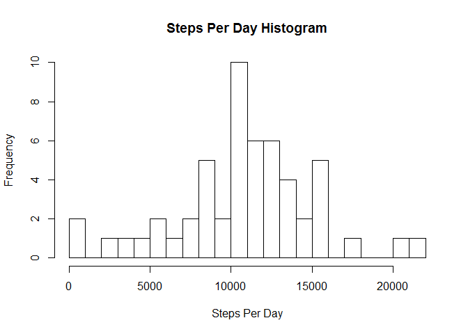
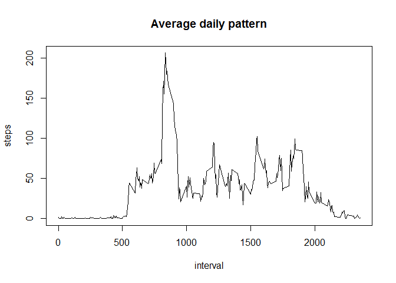
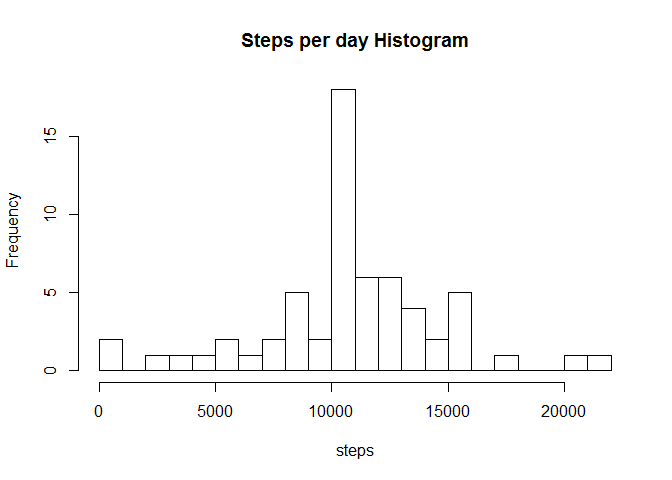
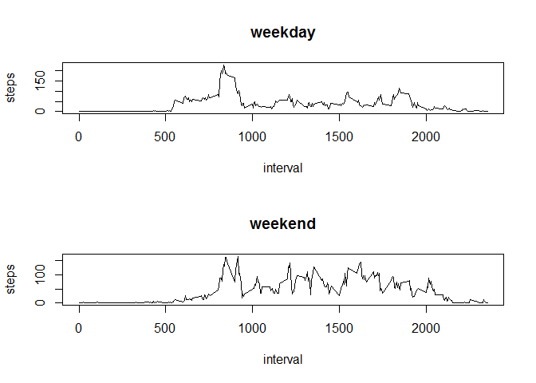

## Loading and preprocessing the data

First, we load the data and remove NA values in preparation for the first analysis:


```r
temp <- tempfile()
download.file("https://d396qusza40orc.cloudfront.net/repdata%2Fdata%2Factivity.zip",temp)
projectdata <- read.csv(unz(temp,"activity.csv"))
projectdata <-projectdata[!is.na(projectdata$steps),]
```


## What is mean total number of steps taken per day?

Next, we calculate the total steps per day, make a histogram of these results and calculate the mean and median:


```r
library(dplyr)
```

```r
stepsperday <- projectdata %>%
        select(steps,date,interval) %>%
        group_by(date) %>%
        summarize(results = sum(steps))
hist(stepsperday$results, breaks = 20,main = "Steps Per Day Histogram", xlab = "Steps Per Day")
```

<!-- -->

```r
mean(stepsperday$results, na.rm=TRUE)
```

```
## [1] 10766.19
```

```r
median(stepsperday$results, na.rm=TRUE)
```

```
## [1] 10765
```

## What is the average daily activity pattern?

Next, we make a time series of the average steps during each 5-minute interval, and find the 5-minute inteval with the maximum number of steps:


```r
stepsperinterval <- projectdata %>%
        select(steps,date,interval) %>%
        group_by(interval) %>%
        summarize(results = mean(steps))
plot(stepsperinterval$interval,stepsperinterval$results,type="l", main = "Average daily pattern",xlab = "interval",ylab="steps")
```

<!-- -->

```r
#visually can see highest point, but to be precise:
(stepsperinterval[order(-stepsperinterval$results),])[1,]
```

```
## # A tibble: 1 x 2
##   interval  results
##      <int>    <dbl>
## 1      835 206.1698
```


## Imputing missing values

Next, we calculate the number of NA's in original dataset, fill in these values with the average for each interval, create a histogram and report the mean and the median. Note that imputing does not have a significant effect on the mean and median since our approach was just to use the averages of the existing data.


```r
#need to reload since we took out NA's before
projectdata2 <- read.csv(unz(temp,"activity.csv"))
sum(is.na(projectdata2$steps))
```

```
## [1] 2304
```

```r
#fill in NA's with means for the interval (this is really just loading the 8 days with averages)
intervalaverages <- (aggregate(steps~interval,data=projectdata2,FUN=mean))
for (i in 1:nrow(projectdata2)){
        tempinterval <- projectdata2[i,3]
        if (is.na(projectdata2[i,1])) {
                projectdata2[i,1] <- intervalaverages[match(tempinterval,intervalaverages$interval),2]    
        }
}
#histogram of results
stepsperday2 <- projectdata2 %>%
        select(steps,date,interval) %>%
        group_by(date) %>%
        summarize(results = sum(steps))
hist(stepsperday2$results,breaks=20, main = "Steps per day Histogram",xlab = "steps")
```

<!-- -->

```r
mean(stepsperday2$results)
```

```
## [1] 10766.19
```

```r
median(stepsperday2$results)
```

```
## [1] 10766.19
```


## Are there differences in activity patterns between weekdays and weekends?

Finally, we create a factor variable indicating "weekend" or "weekday", and then create a panel plot for comparison:


```r
projectdata2$date <- as.Date(projectdata2$date)
projectdata2$weekendindicator <- as.factor(ifelse(weekdays(projectdata2$date)=="Saturday" | weekdays(projectdata2$date)=="Sunday","weekend","weekday"))
par(mfrow=c(2,1))
stepsperinterval <- projectdata2[projectdata2$weekendindicator=="weekday",] %>%
        select(steps,date,interval) %>%
        group_by(interval) %>%
        summarize(results = mean(steps))
plot(stepsperinterval$interval,stepsperinterval$results,type="l", main = "weekday", xlab = "interval", ylab = "steps")
stepsperinterval <- projectdata2[projectdata2$weekendindicator=="weekend",] %>%
        select(steps,date,interval) %>%
        group_by(interval) %>%
        summarize(results = mean(steps))
plot(stepsperinterval$interval,stepsperinterval$results,type="l", main = "weekend", xlab = "interval", ylab = "steps")
```

<!-- -->
